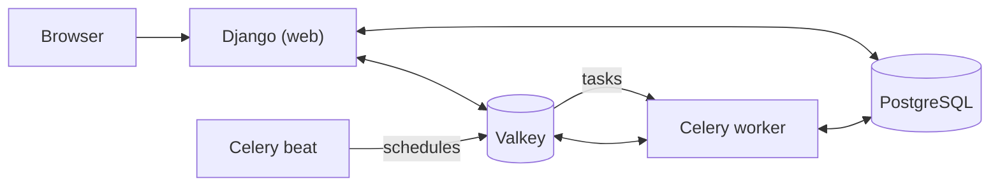
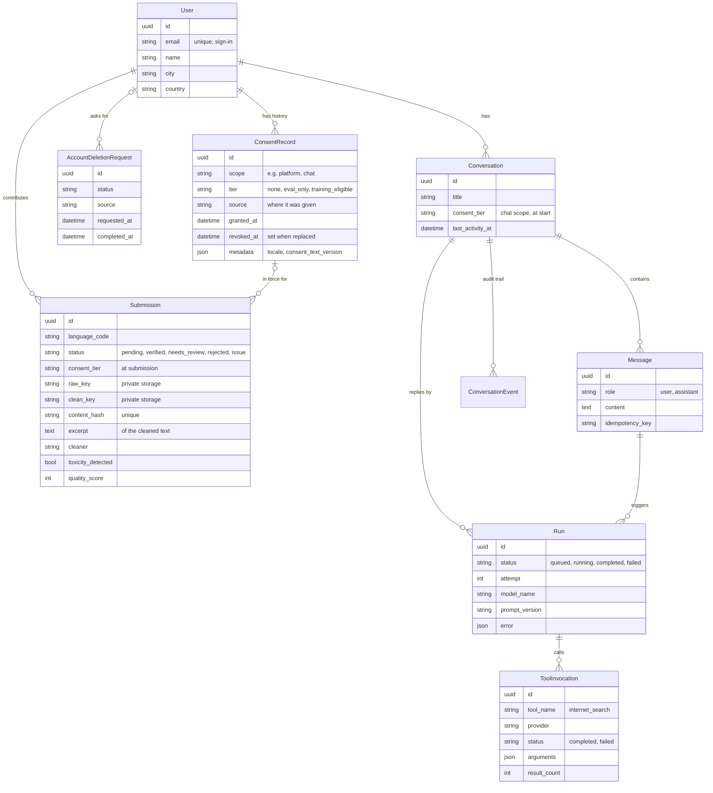

# Architecture

Baibu Community Edition is a Django monolith with Celery for background work.
It renders pages on the server (Django templates styled with Tailwind CSS);
there is no single-page JavaScript application.

## Services

| Service | Role | Licence |
| --- | --- | --- |
| Django (Python 3.14) | Web application, admin, sign-in | BSD-3-Clause |
| PostgreSQL | All relational data | PostgreSQL Licence |
| Valkey | Cache, Celery broker. Any Redis-protocol server works. | BSD-3-Clause |
| Celery worker | Runs background tasks | BSD-3-Clause |
| Celery beat | Schedules periodic tasks (`CELERY_BEAT_SCHEDULE`) | BSD-3-Clause |

Every service is open source and needs no account with a third party.
Files live on the local filesystem or on any S3-compatible object store
([File storage](storage.md)). Later stages add a language-model endpoint
reached through LiteLLM, which the deployment chooses.

## Django apps

| App | Responsibility |
| --- | --- |
| `baibu.core` | Platform settings exposed to templates (`platform` context), language configuration, the file storage interface, the `/health/` endpoint, the worker heartbeat task, and keeping the Site record in line with the platform name and domain. |
| `baibu.users` | The user model (email sign-in, one `name` field), profile completion, consent history, account deletion requests, and the admin for all three. |
| `baibu.submissions` | Text contributions: the submission form and list, the cleaning task and pluggable cleaners, and the admin used for review. See [Submissions and cleaning](submissions.md). |
| `baibu.chat` | The assistant chat: conversations, messages, runs, prompt versions, model variants and the audit trail; the Celery tasks that produce replies. See [Assistant chat](chat.md). |
| `baibu.theme` | The Tailwind source. The built stylesheet is not committed. |

Sign-in, sign-up, email confirmation, password reset and two-factor
authentication come from [django-allauth](https://docs.allauth.org/). The
templates in `baibu/templates/allauth/` restyle its pages; they do not change
its behaviour.

## Data model

Primary keys are UUIDv7, so they sort by creation time and do not reveal
counts.

### Consent

A consent decision is one `ConsentRecord`. Records are append-only: a new
decision adds a row and stamps the previous one with `revoked_at`. The model
refuses edits and single deletes, and the admin is read-only. Code reads
consent through `baibu.users.consent`:

- `consent_state(user=..., scope=...)` returns the current tier, with
  `allows(tier)` for checks. No record, or a revoked latest record, means
  `none`.
- `record_consent(user=..., tier=..., source=...)` records a change.
- `@consent_required(tier)` protects a view; users without enough consent are
  sent to the consent page.

Tiers are ordered: `training_eligible` includes `eval_only`, which includes
`none`. Each feature that uses contributions records under its own `scope`.

### Account deletion

Sending a deletion request deactivates the account at once and signs the
user out. Staff then move the request through `submitted` → `approved` →
`in_progress` → `completed` (or `rejected`, or `failed` and retry). The admin
enforces these transitions. Completing a request clears the requester's
name, email and message. Deleting the user in the admin removes their
consent history; the request stays, without personal details, as a receipt.

New requests are emailed to the active members of the `operations-email`
group, or to `DJANGO_ADMINS` if the group is empty. The email contains only
the receipt number, source and time, never personal details.

## Requests and background work

- Every page goes through `LocaleMiddleware` (language from the URL prefix or
  the language switcher) and `ProfileCompletionMiddleware` (signed-in users
  missing a field in `PROFILE_REQUIRED_FIELDS` are sent to complete their
  profile; sign-in pages, terms, privacy and the admin for staff are exempt).
- Creating a submission queues `baibu.submissions.tasks.clean_submission`
  once the database transaction commits.
- Sending a chat message queues `baibu.chat.tasks.execute_run`; beat runs
  `baibu.chat.tasks.sweep_runs` every minute to recover stuck replies.
- Celery beat sends `baibu.core.tasks.heartbeat` every minute. The worker
  stores the time in the cache, and `/health/` reports the worker as `ok`,
  `stale` or `unknown`. `/health/` returns HTTP 503 only if the database or
  cache is down, so a stopped worker does not restart the web container.

## URLs

The default language has no URL prefix (`/accounts/login/`); other enabled
languages are prefixed (`/fr/accounts/login/`). `/health/` and `/i18n/` are
never prefixed.

| Path | Page |
| --- | --- |
| `/` | Home |
| `/privacy/`, `/terms/` | Placeholders; every deployment replaces them |
| `/accounts/...` | Sign-in, sign-up, email, password, two-factor (allauth) |
| `/users/account/` | Profile |
| `/users/account/consent/` | Consent choice and history |
| `/users/account/delete/` | Account deletion request |
| `/contribute/` | The user's submissions |
| `/contribute/new/` | Submit text |
| `/chat/` | Conversations and a new chat |
| `/chat/consent/` | Chat consent choice |
| `/chat/<id>/` | One conversation |
| `/admin/` | Django admin (path set by `DJANGO_ADMIN_URL`) |
| `/health/` | Health check (JSON) |
