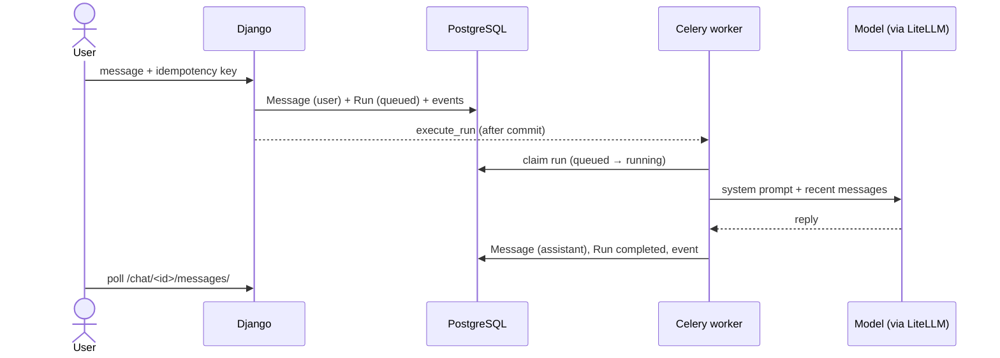

# Assistant chat

Signed-in users can talk with an assistant at `/chat/`. Replies come from a
language model the deployment chooses, reached through
[LiteLLM](https://docs.litellm.ai/). The project does not recommend a
model. Out of the box the assistant uses the built-in `mock` model, which
echoes messages back without any network call, so a new installation works
before a model is configured.

## Consent

Before their first conversation, users choose how their conversations may
be used (`none`, `eval_only` or `training_eligible`), recorded under the
consent scope `CHAT_CONSENT_SCOPE` (default `chat`), separately from the
consent for submissions. Any choice, including `none`, lets them chat: the
conversation is still stored so they can return to it. Each conversation
records the tier in force when it started. Users can delete a conversation
at any time.

## How a reply is produced



- **Idempotent sends.** Each composer form carries a random key. Sending the
  same key twice (a double click, a retried request) returns the first
  message and run instead of creating new ones.
- **One reply at a time.** While a conversation has a queued or running run,
  further sends are refused with a message asking the user to wait.
- **Runs.** A run is one attempt to reply to one user message. The worker
  claims it with a conditional update, so a run is never executed twice.
  The run records the model and prompt version used, token usage, latency
  and, on failure, an error code.
- **Retries.** A failed reply shows *Try again*. A retry creates a new run
  for the same message (the message is not duplicated), up to
  `CHAT_MAX_ATTEMPTS` attempts per message.
- **Recovery.** Every minute, Celery beat runs `sweep_runs`: runs still
  running after `CHAT_RUN_TIMEOUT_SECONDS` are failed (so the user can
  retry), queued runs whose task was lost are sent again, and queued runs
  that never started within three timeouts are failed. A reply that arrives
  after its run was failed is discarded.
- **Context.** The model receives the system prompt and the last
  `CHAT_CONTEXT_MESSAGES` messages up to the one being answered.
- **Audit trail.** Every step is a `ConversationEvent` (conversation
  started, message sent, run queued, started, completed, failed, retried).
  Events are append-only.

The page works without JavaScript (forms post and the page reloads). With
JavaScript, `static/js/chat.js` sends in the background and polls for the
reply.

## Reports

Under each assistant reply, *Report* lets the user say what is wrong
(harmful, wrong or misleading, something else) with an optional note.
Reports go to the staff queue described in [Staff review](staff.md); each
user can report a reply once.

## Models

Staff manage **model variants** in the admin (*Chat → Model variants*).
A variant has a LiteLLM model name, an optional endpoint (`api_base`) and
the **name of an environment variable** that holds the API key: keys are
never stored in the database. Extra parameters (for example
`{"temperature": 0.7}`) are passed on every call. The variant marked
*default* answers new messages; without one, `CHAT_MODEL` is used.

For a self-hosted server that speaks the OpenAI-compatible API, for example:

| Field | Value |
| --- | --- |
| Model | `openai/<model name on your server>` |
| API base | `http://llm.internal:8080/v1` |
| API key env | `LLM_API_KEY` (set in the environment of the worker) |

## Prompts

The system prompt is a Django template. Without an active prompt the
built-in template `chat/system_prompt.txt` is used (a deployment can
override it under `DEPLOYMENT_DIR/templates/`). Staff can also write prompts
in the admin (*Chat → Prompts*):

- Adding a prompt with the name `system` creates the next **version**.
  Versions cannot be edited after they are saved, so every run's
  `prompt_version` points at exactly the text that was used.
- One version per name is **active**. Tick *active* when adding, or use the
  *Make the selected version active* action to switch (or roll back).
- Templates can use `platform` (name, tagline and so on), `user_name`,
  `language_code` and `language_name`.

## Tools: web search

The assistant can call **tools** while it writes a reply. The project ships
one, `internet_search`, offered to the model only when a search provider is
configured:

1. The model asks for `internet_search` with a query.
2. The configured provider returns results (title, link, snippet).
3. The model receives them as JSON and writes its answer; the links are
   listed as **Sources** under the reply.

The model may call tools for up to `CHAT_MAX_TOOL_ROUNDS` rounds; the last
call offers no tools, so it has to answer. A failing search does not fail
the reply: the model is told the search failed. Every call is recorded as a
`ToolInvocation` (tool, provider, arguments, number of results, error,
latency) and as a `tool_completed` or `tool_failed` event. Only `http` and
`https` links are shown.

**No search provider is bundled.** To use one, write a subclass of
`baibu.chat.search.SearchProvider`:

```python
from baibu.chat.search import SearchError, SearchProvider, SearchResult


class MySearchProvider(SearchProvider):
    name = "my-search"

    def search(self, query, *, max_results):
        try:
            hits = call_my_search_service(query, limit=max_results)
        except MyServiceError as exc:
            raise SearchError("Search is unavailable.") from exc
        return [SearchResult(title=h["title"], url=h["url"], snippet=h["text"]) for h in hits]
```

and set `CHAT_SEARCH_PROVIDER=myproject.search.MySearchProvider`. Keep the
service's credentials in environment variables. For development,
`baibu.chat.search.MockSearchProvider` returns made-up `example.org`
results (a query containing `[search-fail]` fails; `[search-empty]` finds
nothing).

## The mock model

`mock` is for development and tests:

- it replies `You said: <message>`;
- a message containing `[mock-fail]` makes the call fail;
- `[mock-tool <name>] <text>` asks for tool `<name>` with the query
  `<text>`, if the tool is available.
