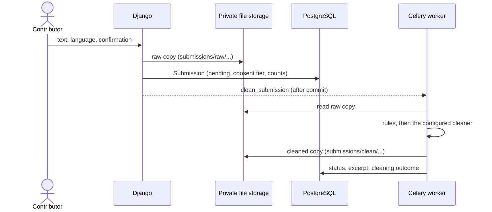

# Submissions and cleaning

People contribute writing in their language. Each contribution is stored,
cleaned and checked before anyone uses it.

## Flow



1. A signed-in contributor with at least `eval_only` consent (scope
   `SUBMISSION_CONSENT_SCOPE`) submits text at `/contribute/new/`. Text is
   between `SUBMISSION_MIN_WORDS` words and `SUBMISSION_MAX_CHARACTERS`
   characters. Text already submitted by anyone (ignoring spacing) is
   refused.
2. The full text goes to private storage ([File storage](storage.md)); the
   database row records the language, counts, a hash for duplicate
   detection and the consent tier and record in force. If storage fails,
   nothing is recorded; if the row cannot be saved, the stored file is
   removed.
3. Once the row is committed, the `clean_submission` task runs:
    - **Rules**, always: Unicode NFC, Unix line breaks, control characters
      removed, spacing tidied, and email addresses, links and phone numbers
      (nine or more digits) replaced by `[email]`, `[link]` and `[phone]`.
    - **The cleaner** named by `SUBMISSION_CLEANER` (below).
    - **Decision**: `needs_review` if the result is empty, possibly toxic,
      scored below `SUBMISSION_MIN_QUALITY`, or detected in a different
      language; otherwise `verified`. A failing cleaner or storage error
      gives `issue`, with the reason recorded and no cleaned file left
      behind.
4. The cleaned text is stored as a separate file; the raw copy is kept
   unchanged. The database keeps only the first `SUBMISSION_EXCERPT_LENGTH`
   characters of the **cleaned** text, which is what the contributor sees on
   `/contribute/`.

Contributors can delete their own submissions. Deleting a submission, or
the user, deletes both stored files once the deletion is committed.

## Cleaners

| `SUBMISSION_CLEANER` | What it does |
| --- | --- |
| `baibu.submissions.cleaners.RuleCleaner` (default) | The rules only. No model, no network. |
| `baibu.submissions.cleaners.LiteLLMCleaner` | After the rules, asks a language model to replace remaining personal data and to rate toxicity and quality. |
| `baibu.submissions.cleaners.MockCleaner` | Deterministic stand-in for a model, for tests and demonstrations. Text containing `mocktoxic` is flagged. |

`LiteLLMCleaner` reaches the model through [LiteLLM](https://docs.litellm.ai/),
so the deployment can use any model LiteLLM supports, hosted or
self-hosted. The project does not recommend one. Set
`SUBMISSION_CLEANER_MODEL` to a LiteLLM model name, and
`SUBMISSION_CLEANER_API_BASE` and `SUBMISSION_CLEANER_API_KEY` if the
endpoint needs them. For example, for a self-hosted server that speaks the
OpenAI-compatible API:

```sh
SUBMISSION_CLEANER=baibu.submissions.cleaners.LiteLLMCleaner
SUBMISSION_CLEANER_MODEL=openai/<model name on your server>
SUBMISSION_CLEANER_API_BASE=http://llm.internal:8080/v1
```

The model only ever sees text the rules have already cleaned. Its
instructions are the template `submissions/cleaner_prompt.txt`; a deployment
can replace it under `DEPLOYMENT_DIR/templates/` (for example to describe
its languages). The model must answer with one JSON object:
`{"text", "redactions", "toxic", "quality", "language"}`. Answers that are
not JSON or have no text are treated as a failure (`issue`).

To write your own cleaner, subclass `baibu.submissions.cleaners.Cleaner`,
return a `CleaningResult` from `clean()`, raise `CleanerError` on failure,
and point `SUBMISSION_CLEANER` at the class.

## Statuses

| From | To | By |
| --- | --- | --- |
| `pending` | `verified`, `needs_review`, `issue` | Cleaning |
| `needs_review` | `verified`, `rejected` | Staff |
| `issue` | `rejected` | Staff |
| `needs_review`, `issue`, `verified`, `rejected` | `pending` | Staff ("Clean again") |
| `verified` | `rejected` | Staff |

Staff use the Django admin for now: filter by status, read the submitted and
cleaned text side by side, add notes, and use the actions *Mark as
verified*, *Mark as rejected* and *Clean again*. A dedicated review queue is
planned (#17).
