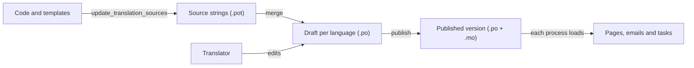

# Translations

The code and templates are written in English. A deployment's translators
translate the interface into its other languages from the site itself, at
`/translations/`, and publish their work without a code change or a
redeploy. Translators who prefer files can still keep `.po` files in the
deployment directory ([White-label deployments](white-label.md#4-languages)).

## Who can translate

Anyone with the **Can edit and publish interface translations** permission
(`localization.edit_translations`). `migrate` creates a `translators` group
that has it; to make someone a translator, open their user in the admin and
add them to that group. They do not need staff status. Superusers can always
translate. Translators see a **Translations** link in the header.

## Workflow

1. **Source strings.** `python manage.py update_translation_sources` extracts
   every marked string from the code and from the deployment's own templates
   (`DEPLOYMENT_DIR/templates`) and merges them into each language's draft.
   The container start scripts run it after `migrate`, so new strings appear
   after an upgrade; translators can also run it from the overview page.
   Existing translations are kept. Messages no longer in the code are kept
   in the draft as obsolete (hidden, never published), so their translation
   returns if the message does.
2. **Drafts.** Each language listed in `PLATFORM_LANGUAGES`, other than
   English, has one draft. A new draft starts from the deployment's own
   `.po` file for that language when there is one. The editor lists messages
   by state (untranslated, needs review, translated, all) with a search, and
   shows where each message is used. Plural messages get one field per plural
   form of the language; the plural rule comes from Django's own catalogue for
   the language when it has one and can be changed on the page.
3. **Checks.** A translation that would break a message's placeholders (an
   unknown `%(name)s`, a different number of `%s`, a lone `%`) is refused with
   an explanation. If someone else saved the same message while you were
   editing it, your change is not saved over theirs; the page says so.
4. **Needs review.** Ticking *Needs review* keeps a translation in the draft
   but out of what is published.
5. **Publishing** compiles the draft and makes it live for that language. Each
   publication is a numbered version that records who published it, when, and
   how many messages were translated. **Published versions** lists them;
   **Restore** makes an earlier version live again as a new version (the
   draft is left as it is).
6. **Offline work.** The draft can be downloaded as a `.po` file and uploaded
   again after editing in any PO editor. Only messages that are in the draft
   are taken from an upload, and the same checks apply.

## Where the files are

Everything is stored through the [file storage interface](storage.md) in the
private store, so it works the same on the local filesystem and on S3:

| Key | Holds |
| --- | --- |
| `translations/sources/<date>/<id>.pot` | Extracted source strings (one per change) |
| `translations/<language>/drafts/<date>/<id>.po` | The current draft (replaced on every save) |
| `translations/<language>/published/<date>/<id>.po`, `.mo` | Each published version, kept for history and restore |

The database (`localization` app) keeps the keys and the audit trail. Nothing
is written into the code directory or the deployment directory.

## How running processes pick up a publication

Every web process and Celery worker copies the newest published `.mo` file of
each language from storage into `LOCALIZATION_PUBLISHED_DIR`, which is the
first entry of `LOCALE_PATHS`, and then clears Django's translation caches.

- Publishing stores the new version's id in the cache. Before handling a
  request (`TranslationSyncMiddleware`, placed before `LocaleMiddleware`) or
  running a task (Celery's `task_prerun` signal), a process compares that id
  with the one it loaded, at most every `LOCALIZATION_SYNC_SECONDS` (10 by
  default). So a publication reaches every process within seconds, and emails
  sent from tasks use it too.
- A process loads published translations on its first request or task, not
  at import time. If the cache is empty, the id is read from the database.
- A language's first publication also makes the language available (for
  example its `/<code>/` URLs) without a restart.
- If loading fails (for example storage is unreachable), the error is logged,
  the page or task carries on with the translations it has, and the process
  tries again at the next check.

### Published translations and deployment files

`LOCALE_PATHS` is `[LOCALIZATION_PUBLISHED_DIR, DEPLOYMENT_DIR/locale]`. For a
message translated in both, the published translation wins. A message left
untranslated in the published version still uses the translation from the
deployment directory, if it has one. Messages from third-party packages (for
example sign-in form labels from django-allauth) come from those packages'
own catalogues and are not in the source strings.

## Settings

See the [configuration reference](configuration.md#translations):
`LOCALIZATION_PUBLISHED_DIR`, `LOCALIZATION_SYNC` and
`LOCALIZATION_SYNC_SECONDS`.

## Requirements

Extracting source strings needs GNU gettext's `xgettext`, which the Docker
image includes. Without Docker, install your system's `gettext` package.
Publishing and loading need nothing beyond the Python dependencies (`polib`).
